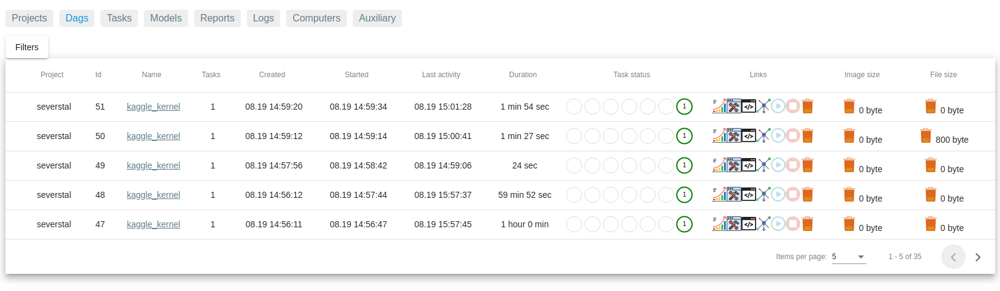
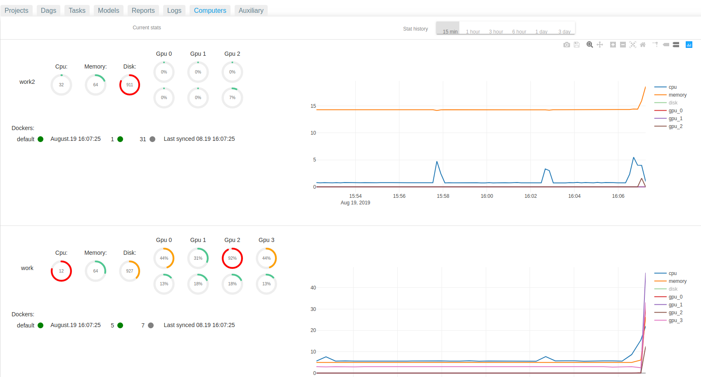
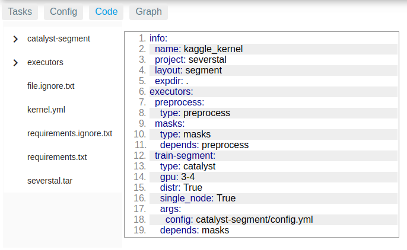
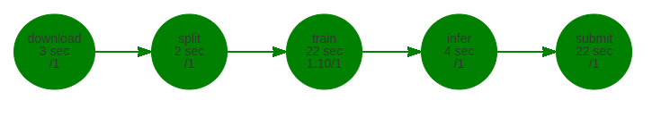

<div align="center">


**MLComp is a distributed DAG (Directed acyclic graph) framework for machine learning with UI**
 
[](https://pypi.org/project/mlcomp/)
[](https://catalyst-team.github.io/mlcomp/index.html)
[](https://pepy.tech/project/mlcomp)
[](https://github.com/catalyst-team/mlcomp/graphs/contributors)
[](LICENSE)

[](https://travis-ci.com/catalyst-team/mlcomp) 
[](https://t.me/catalyst_team)
[](https://gitter.im/catalyst-team/community?utm_source=badge&utm_medium=badge&utm_campaign=pr-badge)
[](https://opendatascience.slack.com/messages/CGK4KQBHD)
[](https://www.patreon.com/catalyst_team)

</div>

The goal of MLComp is to provide tools for training, inferencing, creating complex pipelines
(especially for computer vision) in a rapid, well manageable way. <br/>
MLComp is compatible with: Python 3.6+, Unix operation system. 

Part of [Catalyst Ecosystem](https://docs.google.com/presentation/d/1D-yhVOg6OXzjo9K_-IS5vSHLPIUxp1PEkFGnpRcNCNU/edit?usp=sharing).

**Features**

- Amazing UI
- [Catalyst](https://github.com/catalyst-team/catalyst) support
- Distributed training
- Supervisor that controls computational resources
- Synchronization of both code and data
- Resource monitoring
- Full functionality of the pause and continue on UI
- Auto control of the requirements
- Code dumping (with syntax highlight on UI)
- [Kaggle](https://www.kaggle.com/) integration
- Hierarchical logging
- Grid search
- Experiments comparison
- Customizing layouts

**Contents**

- [Screenshots](#screenshots)

- [Installation](#installation)

- [UI](#ui)

- [Usage](#usage)

- [Docs and examples](#docs-and-examples)

- [Environment variables](#environment-variables)

# Screenshots

Dags



Computers



Reports


Code



Graph



[More screenshots](docs/screenshots.md)

# Installation

1. Install MLComp package

    ```bash
   sudo apt-get install -y \
   libavformat-dev libavcodec-dev libavdevice-dev \
   libavutil-dev libswscale-dev libavresample-dev libavfilter-dev

    pip install mlcomp
    mlcomp init
    mlcomp migrate
    ```

2. Setup your environment. Please consider [Environment variables](#environment-variables) section

3. Run db, redis, mlcomp-server, mlcomp-workers:

    **Variant 1: minimal (if you have 1 computer)**
    
    Run all necessary (mlcomp-server, mlcomp-workers, redis-server), it uses SQLITE:
    
    ```bash
    mlcomp-server start
    ```
   
    **Variant 2: full**
    
    a. Change your [Environment variables](#environment-variables) to use PostgreSql
    
    b. Install rsync on each work computer
    
    ```.env
    sudo apt-get install rsync
    ```
   
    Ensure that every computer is available by SSH protocol with IP/PORT you specified
     in the [Environment variables](#environment-variables) file.
     
     rsync will perform the following commands:
     
     to upload
     ```bash
     rsync -vhru -e "ssh -p {target.port} -o StrictHostKeyChecking=no" \
     {folder}/ {target.user}@{target.ip}:{folder}/ --perms  --chmod=777
     ```
     to download
     
     ```.env
     rsync -vhru -e "ssh -p {source.port} -o StrictHostKeyChecking=no" \
     {source.user}@{source.ip}:{folder}/ {folder}/ --perms  --chmod=777
     ```
   
    c. Install [apex](https://github.com/NVIDIA/apex#quick-start) for distributed learning
    
    d. To Run postgresql, redis-server, mlcomp-server, execute on your server-computer:
    
     ```bash
    cd ~/mlcomp/configs/
    docker-compose -f server-compose.yml up -d
    ```
    
    e. Run on each worker-computer:
    
    ```bash
    mlcomp-worker start
    ```
    
 # UI
 
Web site is available at http://{WEB_HOST}:{WEB_PORT}

By default, it is http://localhost:4201

The front is built with AngularJS.

In case you desire to change it, please consider [front's Readme page](mlcomp/server/front/README.md)
 
 # Usage
 
Run
 ```bash
mlcomp dag PATH_TO_CONFIG.yml
```

This command copies files of the directory to the database.

Then, the server schedules the DAG considering free resources. 

For more information, please consider [Docs](https://catalyst-team.github.io/mlcomp/usage.html)
 
# Docs and examples
 
API documentation and an overview of the library can be
 found here [](https://catalyst-team.github.io/mlcomp/index.html)

You can find advanced tutorials and MLComp best practices in the [examples](examples/) folder of the repository.

# Environment variables

The single file to setup your computer environment is located at ~/mlcomp/configs/.env

- ROOT_FOLDER - folder to save MLComp files: configs, db, tasks, etc.
- TOKEN - site security token. Please change it to any string
- DB_TYPE. Either SQLITE or POSTGRESQL
- POSTGRES_DB. PostgreSql db name
- POSTGRES_USER. PostgreSql user
- POSTGRES_PASSWORD. PostgreSql password
- POSTGRES_HOST. PostgreSql host
- PGDATA. PostgreSql db files location
- REDIS_HOST. Redis host
- REDIS_PORT. Redis port
- REDIS_PASSWORD. Redis password
- WEB_HOST. MLComp site host. 0.0.0.0 means it is available from everywhere
- WEB_PORT. MLComp site port
- CONSOLE_LOG_LEVEL. log level for output to the console
- DB_LOG_LEVEL. log level for output to the database
- IP. Ip of a work computer. The work computer must be accessible from other work computers by these IP/PORT
- PORT. Port of a work computer. The work computer must be accessible from other work computers by these IP/PORT (SSH protocol)
- MASTER_PORT_RANGE. distributed port range for a work computer. 29500-29510 means that if
this work computer is a master in a distributed learning, it will use the first free port
from this range. Ranges of different work computers must not overlap.
- NCCL_SOCKET_IFNAME. NCCL network interface.
- FILE_SYNC_INTERVAL. File sync interval in seconds. 0 means file sync is off
- WORKER_USAGE_INTERVAL. Interval in seconds of writing worker usage to DB
- INSTALL_DEPENDENCIES. True/False. Either install dependent libraries or not
- SYNC_WITH_THIS_COMPUTER. True/False. If False, all computers except that will not sync with that one
- CAN_PROCESS_TASKS. True/False. If false, this computer does not process tasks

You can see your network interfaces with `ifconfig` command.
 Please consider [nvidia doc](https://docs.nvidia.com/deeplearning/sdk/nccl-developer-guide/docs/env.html)
 
